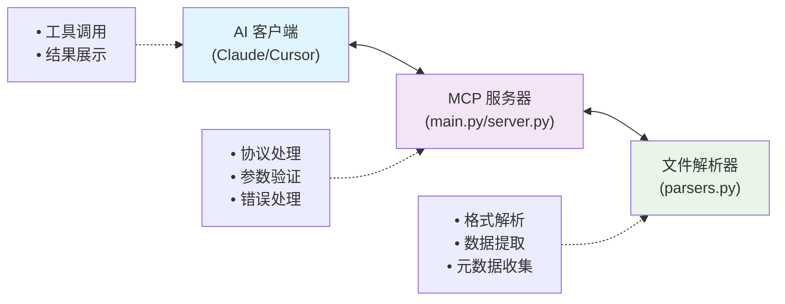

# MCP 文件读取服务器实现报告

## 项目概述

本项目实现了一个基于 Model Context Protocol (MCP) 的文件读取服务器，提供统一的文件解析和读取服务。该服务器可以作为 MCP 工具集成到各种 AI 助手中（如 Claude Desktop、Cursor IDE 等），为 AI 提供强大的文件处理能力。

### 项目目标
- 为 AI 助手提供统一的文件读取接口
- 支持多种常见文件格式的智能解析
- 通过 MCP 协议实现安全、标准化的工具调用
- 提供可扩展的架构支持新格式添加

## 系统架构

### 架构概览



### 核心组件

#### 1. MCP 协议层 (`main.py`, `server.py`)
- **作用**: 实现 MCP 协议的服务器端
- **职责**: 
  - 处理客户端连接和通信
  - 工具注册和调用管理
  - 参数验证和错误处理
  - JSON 序列化和传输

#### 2. 文件解析层 (`parsers.py`, `file_parsers.py`)
- **作用**: 核心业务逻辑，负责文件格式解析
- **职责**:
  - 多格式文件解析
  - 数据提取和处理
  - 元数据收集
  - 性能优化（截断、内存控制）

## 已实现功能

### MCP 工具集

#### 1. `read_file` - 文件读取工具
**功能描述**: 读取并解析文件内容，支持多种格式和参数化配置

**输入参数**:
```json
{
  "file_path": "文件路径（必需）",
  "max_rows": "表格文件最大行数（默认：1000）",
  "max_pages": "PDF文件最大页数（默认：10）", 
  "max_chars": "文本文件最大字符数（默认：10000）",
  "encoding": "文本编码（默认：自动检测）"
}
```

**输出格式**:
```json
{
  "success": true,
  "type": "文件类型",
  "file_path": "文件路径",
  "file_name": "文件名",
  "file_size": "文件大小",
  "file_extension": "扩展名",
  "data": "解析后的数据",
  "metadata": "元数据信息"
}
```

#### 2. `get_formats` / `get_supported_formats` - 格式查询工具
**功能描述**: 获取服务器支持的文件格式列表

**输出示例**:
```json
{
  "success": true,
  "supported_extensions": [".txt", ".csv", ".pdf", ".docx", ".xlsx", ".json", ".md"],
  "format_details": {
    ".csv": {
      "description": "逗号分隔值文件",
      "features": ["数据预览", "列信息", "统计摘要", "缺失值检测"]
    }
  }
}
```

#### 3. `list_files` - 文件列表工具 (server.py 版本)
**功能描述**: 列出指定目录中的文件和子目录

#### 4. `get_file_info` - 文件信息工具 (server.py 版本) 
**功能描述**: 获取文件的基本信息（大小、类型、支持状态等）

### 支持的文件格式

| 格式类别 | 文件扩展名 | 解析功能 | 特殊参数 |
|---------|-----------|----------|----------|
| **文本文件** | `.txt`, `.md` | 完整内容、字数统计、编码检测 | `max_chars`, `encoding` |
| **表格数据** | `.csv`, `.xlsx`, `.xls` | 数据预览、列信息、统计摘要 | `max_rows` |
| **PDF文档** | `.pdf` | 文本提取、页面内容、元数据 | `max_pages` |
| **Word文档** | `.docx` | 段落提取、表格数据 | 无 |
| **PPT演示** | `.pptx` | 幻灯片文本内容 | 无 |
| **JSON数据** | `.json` | 结构化数据解析 | `max_items` |
| **图片文件** | `.jpg`, `.png`, `.gif` | 基本信息（尺寸、格式） | 无 |

## 技术实现细节

### MCP 协议实现

#### 服务器初始化
```python
# main.py:97-111
async def main():
    async with mcp.server.stdio.stdio_server() as (read_stream, write_stream):
        await server.run(
            read_stream,
            write_stream,
            InitializationOptions(
                server_name="file-reader-mcp",
                server_version="0.2.0",
                capabilities=server.get_capabilities(...)
            )
        )
```

#### 工具注册机制
```python
# main.py:21-66
@server.list_tools()
async def handle_list_tools() -> list[types.Tool]:
    return [
        types.Tool(
            name="read_file",
            description="读取并解析文件内容...",
            inputSchema={...}  # JSON Schema 参数定义
        )
    ]
```

#### 工具调用处理
```python
# main.py:68-95
@server.call_tool()
async def handle_call_tool(name: str, arguments: dict) -> list[types.TextContent]:
    if name == "read_file":
        result = parser.parse(**arguments)
    # 返回 JSON 格式化结果
    return [types.TextContent(type="text", text=json.dumps(result, ...))]
```

### 文件解析架构

#### 统一解析接口 (`parsers.py`)
```python
class FileParser:
    SUPPORTED_FORMATS = {
        '.txt': 'parse_text',
        '.csv': 'parse_csv',
        '.pdf': 'parse_pdf',
        # ...
    }
    
    def parse(self, file_path: str, **options) -> Dict[str, Any]:
        ext = Path(file_path).suffix.lower()
        method_name = self.SUPPORTED_FORMATS[ext]
        method = getattr(self, method_name)
        return method(file_path, **options)
```

#### 模块化解析器设计 (`file_parsers.py`)
```python
class FileParserBase:
    def parse(self, file_path: str, **kwargs) -> Dict[str, Any]:
        raise NotImplementedError

class CSVParser(FileParserBase):
    def parse(self, file_path: str, **kwargs) -> Dict[str, Any]:
        # CSV 特定解析逻辑
        
class FileParserManager:
    def __init__(self):
        self.parsers = {
            '.csv': CSVParser(),
            '.pdf': PDFParser(),
            # ...
        }
```

### 关键技术特性

#### 1. 内存控制和性能优化
- **大文件截断**: 通过 `max_rows`, `max_pages`, `max_chars` 参数控制
- **流式处理**: PDF 和大文本文件的分页/分块处理
- **编码自动检测**: 使用 `chardet` 库自动识别文本编码

#### 2. 错误处理机制
```python
def _error_result(self, error_msg: str) -> Dict[str, Any]:
    return {
        "success": False,
        "error": error_msg
    }

try:
    result = method(file_path, **options)
except Exception as e:
    return self._error_result(f"解析失败: {str(e)}")
```

#### 3. 标准化数据格式
所有解析结果都遵循统一的数据结构：
```json
{
  "success": boolean,
  "type": "文件类型标识",
  "file_path": "完整路径", 
  "file_name": "文件名",
  "file_size": "字节大小",
  "file_extension": "扩展名",
  "data": "格式特定数据",
  "metadata": "元数据信息"
}
```

## 性能与限制

### 性能特性
- **内存安全**: 自动截断超大文件，防止内存溢出
- **并发支持**: 基于 asyncio 的异步处理
- **缓存友好**: 轻量级解析，适合频繁调用
- **错误恢复**: 单文件解析失败不影响其他操作

### 默认限制配置
```python
# 性能参数默认值
{
    "max_rows": 1000,      # CSV/Excel 最大行数
    "max_pages": 10,       # PDF 最大页数  
    "max_chars": 10000,    # 文本文件最大字符数
    "max_items": 100       # JSON 数组最大元素数
}
```

### 依赖库清单
```toml
# pyproject.toml 主要依赖
dependencies = [
    "mcp>=1.0.0",          # MCP 协议核心
    "pandas>=2.0.0",       # 数据处理
    "python-docx>=1.1.0",  # Word 文档解析
    "PyMuPDF>=1.23.0",     # PDF 解析
    "openpyxl>=3.1.0",     # Excel 文件支持
    "python-pptx>=0.6.0",  # PowerPoint 解析
    "Pillow>=10.0.0",      # 图片处理
    "chardet>=5.0.0",      # 编码检测
]
```

## 部署与使用

### 安装部署
```bash
# 1. 环境准备
cd mcp_server
uv sync  # 或 pip install -r requirements.txt

# 2. 服务启动
uv run python main.py
# 或 uv run file-reader-mcp
```

## 总结

本 MCP 文件读取服务器项目成功实现了：

- 完整的 MCP 协议支持 - 标准化的工具调用接口

- 多格式文件解析 - 支持 9+ 种常见文件格式

- 参数化配置 - 灵活的性能和输出控制

- 模块化架构 - 易于扩展的设计模式

- 错误处理机制 - 完善的异常处理和恢复

  
