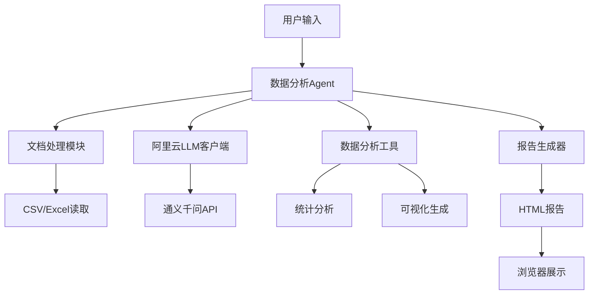
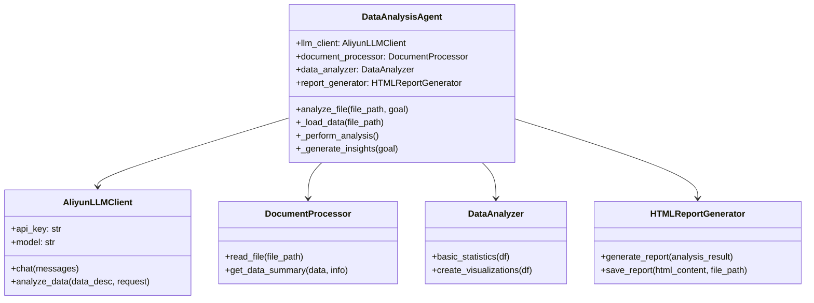
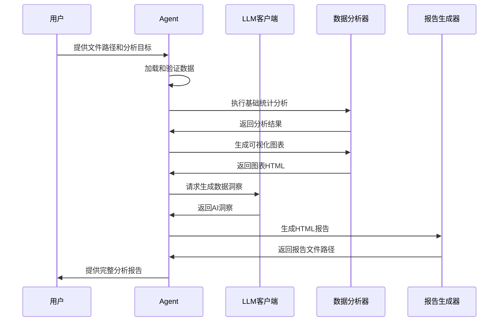
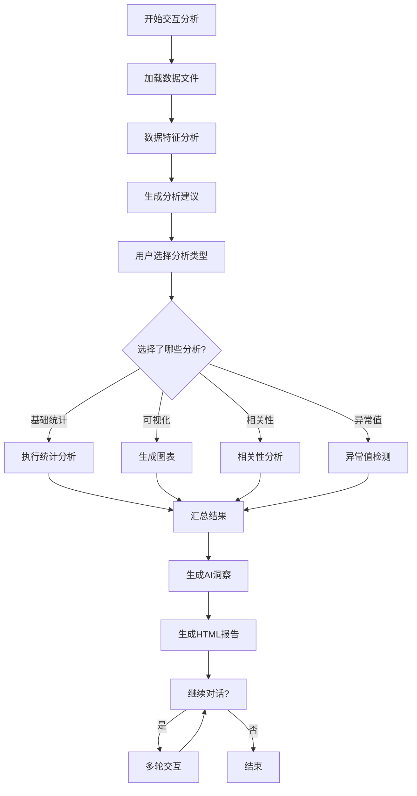

# 数据分析Agent MVP版本 - 项目开发报告

## 项目概述

本项目基于阿里云通义千问大模型开发了一个智能数据分析Agent，实现了从数据读取到报告生成的完整分析流程。该Agent采用半自主模式，能够根据数据特征提供分析建议，同时允许用户参与决策过程。

### 项目目标

- 构建一个实用的数据分析自动化工具
- 集成大语言模型提供智能洞察
- 生成专业的HTML分析报告
- 提供灵活的交互模式

## 技术架构

### 整体架构设计



### 核心组件关系



## 功能实现

### 主要功能模块

#### 1. 数据读取模块

支持多种文件格式的自动识别和处理：

- CSV文件（支持UTF-8、GBK、GB2312编码）
- Excel文件（.xlsx、.xls格式）
- 自动编码检测和错误处理

#### 2. 分析引擎模块

实现了以下分析功能：

- 基础统计分析（均值、标准差、分位数等）
- 缺失值检测和统计
- 数据类型识别和分类
- 异常值检测（IQR方法）
- 相关性分析
- 数据分布可视化

#### 3. 可视化模块

基于Plotly生成交互式图表：

- 直方图显示数据分布
- 相关性热图
- 分类变量饼图
- 所有图表支持HTML内嵌显示

#### 4. LLM集成模块

与阿里云通义千问模型深度集成：

- 自动生成数据洞察
- 基于分析结果提供业务建议
- 支持自然语言交互
- 错误处理和降级机制

## 工作流程

### Agent执行流程



### 交互模式流程



## 技术实现细节

### 文件处理策略

对于不同类型的文件采用了不同的处理策略：

1. **CSV文件处理**：实现了多编码尝试机制，依次尝试UTF-8、GBK、GB2312编码
2. **Excel文件处理**：使用pandas的read_excel功能，支持多工作表文件
3. **错误处理**：实现了完整的异常捕获和用户友好的错误信息

### 分析算法选择

采用了经过验证的统计学方法：

- **异常值检测**：使用IQR（四分位距）方法，具有良好的鲁棒性
- **相关性分析**：基于Pearson相关系数，适用于线性关系检测
- **可视化选择**：根据数据类型自动选择合适的图表类型

### LLM集成设计

实现了稳健的大模型调用机制：

- **API封装**：统一的LLM客户端接口
- **错误处理**：网络异常和API限制的处理
- **提示词工程**：针对数据分析场景优化的提示词模板
- **降级机制**：LLM不可用时提供基础分析结果

##  项目优势

### 半自主

该Agent采用半自主模式，平衡了自动化和用户控制：

- **智能建议**：根据数据特征自动推荐合适的分析方法
- **用户决策**：用户可以选择执行哪些分析，保持控制权
- **灵活交互**：支持多轮对话，可以根据初步结果深入分析

### 可扩展架构

项目采用了模块化设计，便于后续扩展：

- **工具库设计**：每个分析功能都封装为独立工具
- **插件化接口**：新的分析方法可以轻松集成
- **模板化报告**：报告格式可以通过模板系统定制

## 部署和使用

### 环境要求

- Python 3.8+
- uv包管理器（推荐）或pip
- 主要依赖：pandas, plotly, openai, jinja2
- 网络连接（访问阿里云API）

### 项目结构

```
data_analysis_agent/
├── data_analysis_agent/       # 主包
│   ├── __init__.py           # 包初始化
│   ├── main.py               # 命令行入口
│   ├── agent.py              # 简单模式Agent
│   ├── interactive_agent.py  # 交互模式Agent
│   ├── core/                 # 核心模块
│   │   ├── llm_client.py     # 阿里云大模型API客户端
│   │   └── report_generator.py # HTML报告生成器
│   └── tools/                # 工具库
│       ├── document_processor.py # 文档处理工具
│       └── data_analyzer.py  # 数据分析工具
├── examples/                 # 示例和测试
├── pyproject.toml           # 项目配置
└── uv.lock                  # 依赖锁定文件
```

### 安装和使用

1. **环境准备**：
   ```bash
   # 使用uv管理项目（推荐）
   uv sync
   
   # 或使用pip安装
   pip install -e .
   ```

2. **使用方式**：
   ```bash
   # 简单模式
   uv run data-agent examples/simple_test_data.csv --goal "分析目标"
   
   # 交互模式
   uv run data-agent examples/simple_test_data.csv --interactive
   ```

3. **Python API**：
   ```python
   from data_analysis_agent import DataAnalysisAgent, InteractiveDataAgent
   
   # 创建Agent实例
   agent = DataAnalysisAgent()
   report_path = agent.analyze_file("data.csv", "分析目标")
   ```

### 配置管理

- API密钥通过环境变量或参数设置
- 支持测试模式，无需网络连接
- 使用pyproject.toml统一管理依赖

## 项目局限性

### 当前限制

1. **文件格式**：目前仅支持CSV和Excel格式
2. **数据规模**：建议文件大小不超过100MB
3. **分析深度**：现阶段专注于探索性数据分析
4. **网络依赖**：需要稳定的网络连接访问LLM服务

### 已知问题

- 中文CSV文件编码可能需要手动调整
- 复杂的多层级Excel文件支持有限
- 大文件处理时内存使用量较高

## 项目整理成果

### 代码结构优化

在MVP开发完成后，项目进行了全面整理：

- **包结构标准化**：采用标准Python包结构，提高代码组织性
- **依赖管理现代化**：从requirements.txt迁移到pyproject.toml + uv管理
- **代码去重**：移除重复的Agent实现，保留最核心的MVP版本
- **命令行接口**：统一的`data-agent`命令行工具，支持多种使用方式

### 技术改进

- **错误处理增强**：改进了网络连接和API调用的错误处理机制
- **测试模式支持**：新增离线测试模式，便于开发调试
- **导入路径统一**：规范化了包内模块的导入路径
- **配置简化**：简化了API密钥和参数配置方式

### 文件清理

移除的无关文件：
- `simple_agent.py`（与simple_clean_agent.py重复）
- `core/agent.py`（复杂版本，保留简化版）
- `requirements.txt`（使用pyproject.toml替代）
- 空的`templates/`和`tests/`目录

### 使用体验提升

- **安装便捷性**：`uv sync`一键安装所有依赖
- **命令统一性**：`uv run data-agent`统一入口
- **API简洁性**：`from data_analysis_agent import DataAnalysisAgent`

## 后续规划

- 添加PDF和Word文档支持
- 实现Web界面版本
- 增加时间序列分析功能
- 优化大文件处理性能

